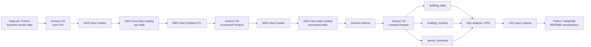
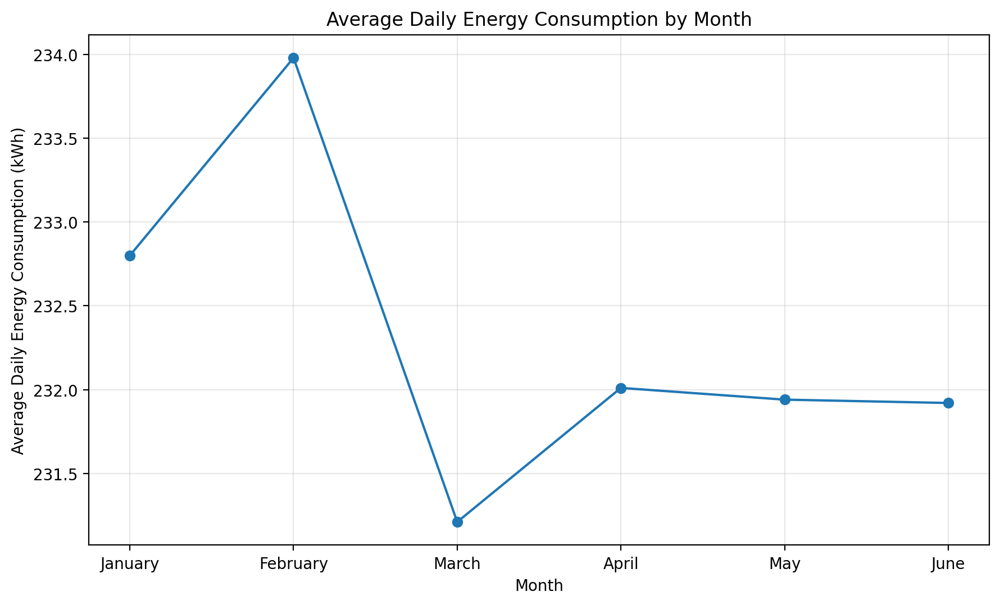
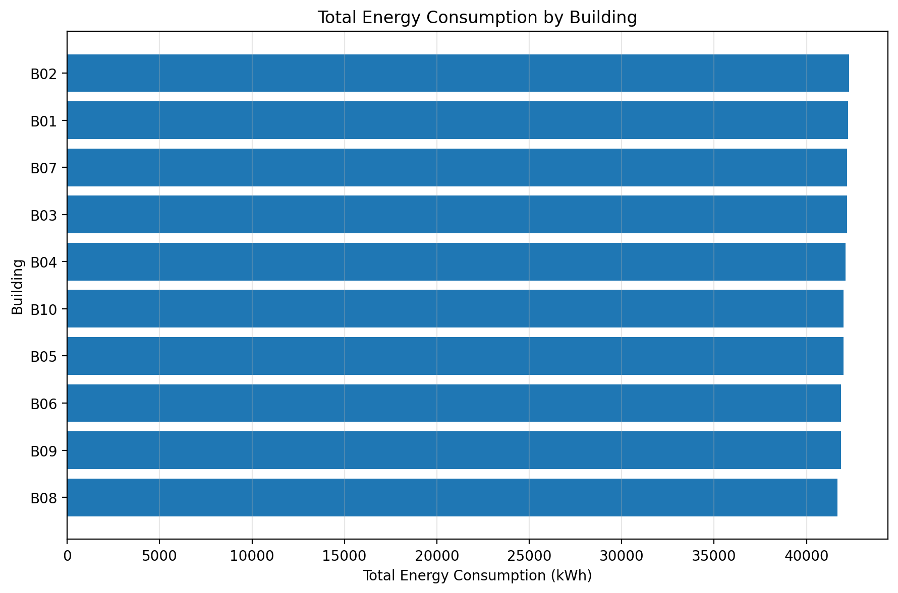
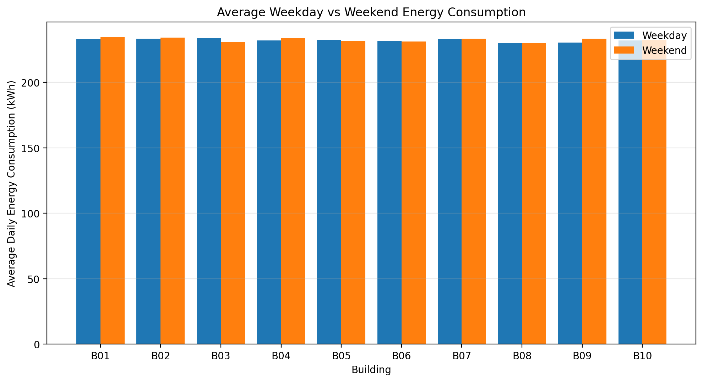

# Smart Energy Monitoring Data Platform — AWS

An end-to-end cloud data engineering project that ingests synthetic smart-energy sensor data, validates and cleans it with AWS Glue and PySpark, stores analytics-ready data in Parquet, and queries curated datasets with Amazon Athena.

The project is an AWS version of an earlier local/DataLab pipeline, rebuilt to demonstrate cloud storage, cataloguing, ETL, data-quality validation, columnar storage and SQL analytics.

## Architecture



## Tech Stack

- **Amazon S3** — raw, processed and curated data storage
- **AWS Glue Crawler** — schema discovery
- **AWS Glue Data Catalog** — table metadata
- **AWS Glue / PySpark** — ETL, validation, deduplication and imputation
- **Amazon Athena** — serverless SQL analytics and CTAS transformations
- **Apache Parquet + Snappy** — analytics-oriented columnar storage
- **AWS IAM** — least-privilege service permissions
- **Amazon CloudWatch** — Glue job logging
- **Python / pandas / Matplotlib** — presentation of final Athena outputs

## Dataset

The synthetic dataset represents hourly energy readings from:

- **10 buildings**
- **50 sensors**
- **1 January 2026 to 30 June 2026**
- **218,286 raw rows** after intentional data-quality perturbations

The raw dataset contains realistic data-quality issues including missing timestamps, missing energy readings, duplicate sensor readings, invalid voltage readings and corrupted energy values.

## Data Layers

### Raw

The original CSV is stored in:

```text
s3://<your-bucket-name>/raw/
```

The raw layer is preserved without cleaning so that the ingestion source remains auditable.

### Processed

AWS Glue runs the PySpark ETL job in [`glue/smart_energy_cleaning_job.py`](glue/smart_energy_cleaning_job.py).

The job:

- converts raw strings to strongly typed columns
- removes rows without valid timestamps
- validates sensor IDs
- rebuilds `building_id` from `sensor_id`
- removes duplicate `(timestamp, sensor_id)` readings
- validates voltage, current, power factor and temperature
- imputes invalid/missing measurements using sensor medians with an overall-median fallback
- recalculates `power_kw` and `energy_kwh`
- writes the cleaned dataset as Parquet

Final processed row count:

**215,045 rows**

### Curated

Athena CTAS queries create three analytics-ready Parquet tables:

| Table | Grain | Rows |
|---|---|---:|
| `building_daily` | One row per building per day | 1,810 |
| `building_monthly` | One row per building per month | 60 |
| `sensor_summary` | One row per sensor | 50 |

## Data Quality

The raw and processed datasets were checked in Athena.

| Check | Raw | Processed |
|---|---:|---:|
| Total rows | 218,286 | 215,045 |
| Missing timestamps | 2,183 | 0 |
| Missing energy values | 2,175 | 0 |
| Genuine duplicate key groups | 1,058 | 0 |
| Invalid voltage readings | 436 | 0 |
| Invalid energy values | 872* | 0 |
| Invalid temperatures | — | 0 |

\*436 negative-energy readings and 436 extreme-energy readings were identified in the raw layer.

## Overall KPIs

| KPI | Result |
|---|---:|
| Date range | 2026-01-01 to 2026-06-30 |
| Buildings | 10 |
| Sensors | 50 |
| Clean sensor readings | 215,045 |
| Total energy | 420,437.62 kWh |
| Average sensor power | 1.955 kW |
| Peak sensor power | 4.968 kW |
| Average voltage | 230.01 V |
| Average power factor | 0.85 |
| Average temperature | 10.05 °C |

## Analysis

### Average Daily Energy Consumption by Month



Monthly totals are affected by month length, so average daily consumption is used for like-for-like comparison. February recorded the highest average daily building consumption at **233.98 kWh**, while March was lowest at **231.21 kWh**.

### Total Energy Consumption by Building



Building energy consumption was tightly clustered. **B02** recorded the highest total at **42,295.19 kWh**, while **B08** recorded the lowest at **41,666.30 kWh**.

### Average Weekday vs Weekend Energy Consumption



The synthetic dataset shows no strong or consistent weekday/weekend effect. The largest positive weekend difference was **B09 (+1.29%)**, while the largest decrease was **B03 (-1.28%)**.

## SQL

The [`sql/`](sql/) directory contains the Athena SQL used to build and analyse the curated layer:

1. `01_building_daily.sql`
2. `02_building_monthly.sql`
3. `03_sensor_summary.sql`
4. `04_data_quality_checks.sql`
5. `05_overall_kpis.sql`
6. `06_building_analysis.sql`
7. `07_monthly_trends.sql`
8. `08_sensor_analysis.sql`
9. `09_month_on_month_analysis.sql`
10. `10_weekday_weekend_analysis.sql`

## Repository Structure

```text
smart-energy-data-platform/
├── glue/
│   └── smart_energy_cleaning_job.py
├── sql/
│   ├── 01_building_daily.sql
│   ├── 02_building_monthly.sql
│   ├── 03_sensor_summary.sql
│   ├── 04_data_quality_checks.sql
│   ├── 05_overall_kpis.sql
│   ├── 06_building_analysis.sql
│   ├── 07_monthly_trends.sql
│   ├── 08_sensor_analysis.sql
│   ├── 09_month_on_month_analysis.sql
│   └── 10_weekday_weekend_analysis.sql
├── results/
│   ├── overall_kpis.csv
│   ├── building_analysis.csv
│   ├── monthly_trends.csv
│   └── weekday_weekend_analysis.csv
├── images/
│   ├── monthly_energy_trend.png
│   ├── building_energy_consumption.png
│   └── weekday_weekend_energy.png
└── README.md
```

## Security and Account-Specific Values

Public repository code intentionally uses placeholders such as:

```text
s3://<your-bucket-name>/processed/
```

instead of the real S3 bucket name or AWS account-specific identifiers.

An S3 bucket name is **not a credential and does not grant access by itself**. However, account-regional bucket names can contain account-identifying information. Replacing these values with placeholders is therefore used here as sensible privacy and security hygiene.

The public Glue script also accepts the processed S3 path through the `--OUTPUT_PATH` job parameter rather than hard-coding an account-specific bucket name.

Do not commit AWS access keys, secret access keys, session tokens, passwords, MFA codes or other credentials to a public repository.

## Notes

- The source data is synthetic and was intentionally corrupted to exercise data-quality handling.
- Raw and generated Parquet datasets are kept in S3 rather than committed to GitHub.
- Visualisations are generated from final Amazon Athena query outputs using Python, pandas and Matplotlib.
- The AWS deployment used the Europe (Stockholm) region (`eu-north-1`).
